|コマンド名|結果|
|:---------|:--------|
| `\frac` | 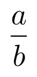 |
| `\sqrt` | 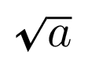 |
| `\lower` | 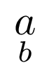 |
| `\upper` | 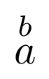 |
| `\mathord` |  |
| `\mathbin` |  |
| `\mathrel` |  |
| `\mathop` |  |
| `\mathprefix` |  |
| `\mathpunct` | 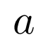 |
| `\mathrm` | 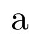 |
| `\mathbf` |  |
| `\mathcal` |  |
| `\mathfrak` | 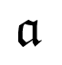 |
| `\mathbb` | 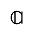 |
| `\bm` | 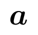 |
| `\alpha` | 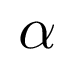 |
| `\beta` | 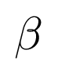 |
| `\gamma` | 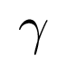 |
| `\delta` | 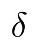 |
| `\epsilon` | 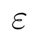 |
| `\zeta` | 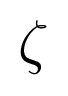 |
| `\eta` | 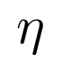 |
| `\theta` | 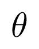 |
| `\iota` | 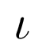 |
| `\kappa` | 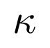 |
| `\lambda` | 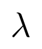 |
| `\mu` | 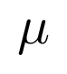 |
| `\nu` | 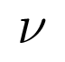 |
| `\xi` | 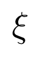 |
| `\omicron` | 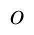 |
| `\pi` | 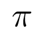 |
| `\rho` | 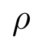 |
| `\sigma` | 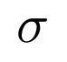 |
| `\tau` | 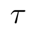 |
| `\upsilon` | 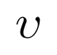 |
| `\phi` | 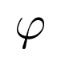 |
| `\chi` | 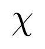 |
| `\psi` | 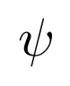 |
| `\omega` | 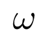 |
| `\Alpha` | 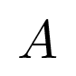 |
| `\Beta` | 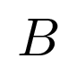 |
| `\Gamma` | 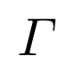 |
| `\Delta` | 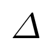 |
| `\Epsilon` | 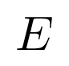 |
| `\Zeta` | 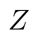 |
| `\Eta` | 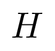 |
| `\Theta` | 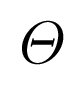 |
| `\Iota` | 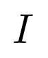 |
| `\Kappa` | 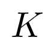 |
| `\Lambda` | 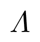 |
| `\Mu` | 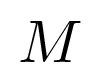 |
| `\Nu` | 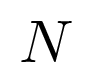 |
| `\Xi` | 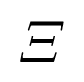 |
| `\Omicron` | 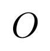 |
| `\Pi` | 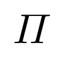 |
| `\Rho` | 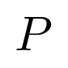 |
| `\Sigma` |  |
| `\Tau` |  |
| `\Upsilon` |  |
| `\Phi` |  |
| `\Chi` |  |
| `\Psi` |  |
| `\Omega` |  |
| `\to` |  |
| `\pm` |  |
| `\mp` |  |
| `\times` |  |
| `\setminus` |  |
| `\ast` |  |
| `\circ` |  |
| `\bullet` |  |
| `\cap` |  |
| `\cup` |  |
| `\uplus` |  |
| `\sqcap` |  |
| `\sqcup` |  |
| `\wedge` |  |
| `\vee` |  |
| `\oplus` |  |
| `\ominus` |  |
| `\otimes` |  |
| `\oslash` |  |
| `\vdash` |  |
| `\nvdash` |  |
| `\dashv` |  |
| `\vDash` |  |
| `\nvDash` |  |
| `\Vdash` |  |
| `\nVdash` |  |
| `\colon-rel` |  |
| `\leq` |  |
| `\geq` |  |
| `\equiv` |  |
| `\nequiv` |  |
| `\neq` |  |
| `\sim` |  |
| `\nsim` |  |
| `\simeq` |  |
| `\nsimeq` |  |
| `\propto` |  |
| `\coloneq` |  |
| `\eqcolon` |  |
| `\in` |  |
| `\nin` |  |
| `\ni` |  |
| `\nni` |  |
| `\subset` |  |
| `\supset` |  |
| `\nsubset` |  |
| `\nsupset` |  |
| `\subseteq` |  |
| `\supseteq` |  |
| `\nsubseteq` |  |
| `\nsupseteq` |  |
| `\subsetneq` |  |
| `\supsetneq` |  |
| `\sqsubset` |  |
| `\sqsupset` |  |
| `\sqsubseteq` |  |
| `\sqsupseteq` |  |
| `\nsqsubseteq` |  |
| `\nsqsupseteq` |  |
| `\sqsubsetneq` |  |
| `\sqsupsetneq` |  |
| `\prec` |  |
| `\succ` |  |
| `\nprec` |  |
| `\nsucc` |  |
| `\preccurlyeq` |  |
| `\succcurlyeq` |  |
| `\precsim` |  |
| `\succsim` |  |
| `\npreccurlyeq` |  |
| `\nsucccurlyeq` |  |
| `\emptyset` |  |
| `\infty` |  |
| `\top` |  |
| `\bot` |  |
| `\therefore` |  |
| `\because` |  |
| `\forall` |  |
| `\exists` |  |
| `\nexists` |  |
| `\bigcirc` |  |
| `\cdot` |  |
| `\ldots` |  |
| `\cdots` |  |
| `\vdots` |  |
| `\ddots` |  |
| `\backddots` |  |
| `\lim` |  |
| `\colim` |  |
| `\max` |  |
| `\min` |  |
| `\inf` |  |
| `\sup` |  |
| `\sin` |  |
| `\cos` |  |
| `\tan` |  |
| `\cot` |  |
| `\sec` |  |
| `\csc` |  |
| `\log` |  |
| `\tr` |  |
| `\det` |  |
| `\dom` |  |
| `\cod` |  |
| `\Ker` |  |
| `\Im` |  |
| `\sum` |  |
| `\prod` |  |
| `\coprod` |  |
| `\bigwedge` |  |
| `\bigvee` |  |
| `\bigcap` |  |
| `\bigcup` |  |
| `\lnot` |  |
| `\land` |  |
| `\lor` |  |
| `\Leftarrow` |  |
| `\Rightarrow` |  |
| `\Leftrightarrow` |  |
| `\Uparrow` |  |
| `\Downarrow` |  |
| `\Updownarrow` |  |
| `\nLeftarrow` |  |
| `\nRightarrow` |  |
| `\nLeftrightarrow` |  |
| `\leftarrow` |  |
| `\rightarrow` |  |
| `\uparrow` |  |
| `\downarrow` |  |
| `\updownarrow` |  |
| `\nwarrow` |  |
| `\nearrow` |  |
| `\searrow` |  |
| `\swarrow` |  |
| `\nleftarrow` |  |
| `\nrightarrow` |  |
| `\nleftrightarrow` |  |
| `\mapsto` |  |
| `\hookleftarrow` |  |
| `\hookrightarrow` |  |
| `\rightarrowtail` |  |
| `\leftarrowtail` |  |
| `\twoheadleftarrow` |  |
| `\twoheadrightarrow` |  |
| `\twoheaduparrow` |  |
| `\twoheaddownarrow` |  |
| `\leftharpoonup` |  |
| `\leftharpoondown` |  |
| `\rightharpoonup` |  |
| `\rightharpoondown` |  |
| `\rightleftharpoons` |  |
| `\upharpoonright` |  |
| `\upharpoonleft` |  |
| `\downharpoonright` |  |
| `\downharpoonleft` |  |
| `\longleftarrow` |  |
| `\longrightarrow` |  |
| `\longleftrightarrow` |  |
| `\Longleftarrow` |  |
| `\Longrightarrow` |  |
| `\Longleftrightarrow` |  |
| `\circlearrowleft` |  |
| `\circlearrowright` |  |
| `\between` |  |
| `\pitchfork` |  |
| `\intercal` |  |
| `\ll` |  |
| `\gg` |  |
| `\lll` |  |
| `\ggg` |  |
| `\leqq` |  |
| `\geqq` |  |
| `\lneqq` |  |
| `\gneqq` |  |
| `\lnsim` |  |
| `\gnsim` |  |
| `\precnsim` |  |
| `\succnsim` |  |
| `\Subset` |  |
| `\Supset` |  |
| `\Cap` |  |
| `\Cup` |  |
| `\lhd` |  |
| `\rhd` |  |
| `\unlhd` |  |
| `\unrhd` |  |
| `\triangleleft` |  |
| `\triangleright` |  |
| `\trianglelefteq` |  |
| `\trianglerighteq` |  |
| `\backsim` |  |
| `\backsimeq` |  |
| `\eqcirc` |  |
| `\cong` |  |
| `\simneq` |  |
| `\ncong` |  |
| `\approx` |  |
| `\napprox` |  |
| `\approxeq` |  |
| `\curlyeqprec` |  |
| `\curlyeqsucc` |  |
| `\lessdot` |  |
| `\gtrdot` |  |
| `\lesssim` |  |
| `\gtrsim` |  |
| `\nlesssim` |  |
| `\ngtrsim` |  |
| `\lessgtr` |  |
| `\gtrless` |  |
| `\nlessgtr` |  |
| `\ngtrless` |  |
| `\ntriangleleft` |  |
| `\ntriangleright` |  |
| `\ntrianglelefteq` |  |
| `\ntrianglerighteq` |  |
| `\lesseqgtr` |  |
| `\gtreqless` |  |
| `\nless` |  |
| `\ngtr` |  |
| `\nleq` |  |
| `\ngeq` |  |
| `\asymp` |  |
| `\nasymp` |  |
| `\circeq` |  |
| `\Bumpeq` |  |
| `\bumpeq` |  |
| `\doteq` |  |
| `\doteqdot` |  |
| `\fallingdotseq` |  |
| `\risingdotseq` |  |
| `\mid` |  |
| `\nmid` |  |
| `\parallel` |  |
| `\nparallel` |  |
| `\Vvdash` |  |
| `\VDash` |  |
| `\coloncoloneq` |  |
| `\leqslant` |  |
| `\geqslant` |  |
| `\dashV` |  |
| `\Dashv` |  |
| `\DashV` |  |
| `\preceq` |  |
| `\succeq` |  |
| `\amalg` |  |
| `\dotplus` |  |
| `\divideontimes` |  |
| `\odot` |  |
| `\circledcirc` |  |
| `\circledast` |  |
| `\circleddash` |  |
| `\boxplus` |  |
| `\boxminus` |  |
| `\boxtimes` |  |
| `\boxdot` |  |
| `\curlyvee` |  |
| `\curlywedge` |  |
| `\Join` |  |
| `\ltimes` |  |
| `\rtimes` |  |
| `\leftthreetimes` |  |
| `\rightthreetimes` |  |
| `\wr` |  |
| `\diamond` |  |
| `\star` |  |
| `\complement` |  |
| `\angle` |  |
| `\measuredangle` |  |
| `\sphericalangle` |  |
| `\int` |  |
| `\ordd` |  |
| `\partial` |  |
| `\nabla` |  |
| `\paren` |  |
| `\app` |  |
| `\angle-bracket` |  |
| `\brace` |  |
| `\sqbracket` |  |
| `\abs` |  |
| `\norm` |  |
| `\floor` |  |
| `\ceil` |  |
| `\set` |  |
| `\setsep` |  |
| `\synteq` |  |
| `\tyjd` |  |
| `\tmabstyped` |  |

